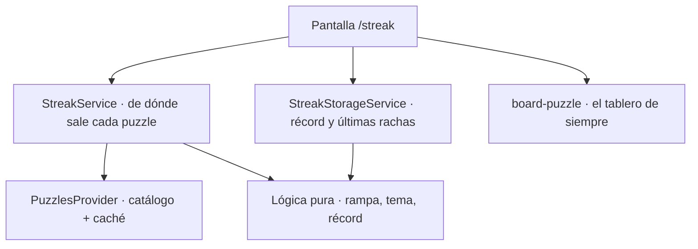
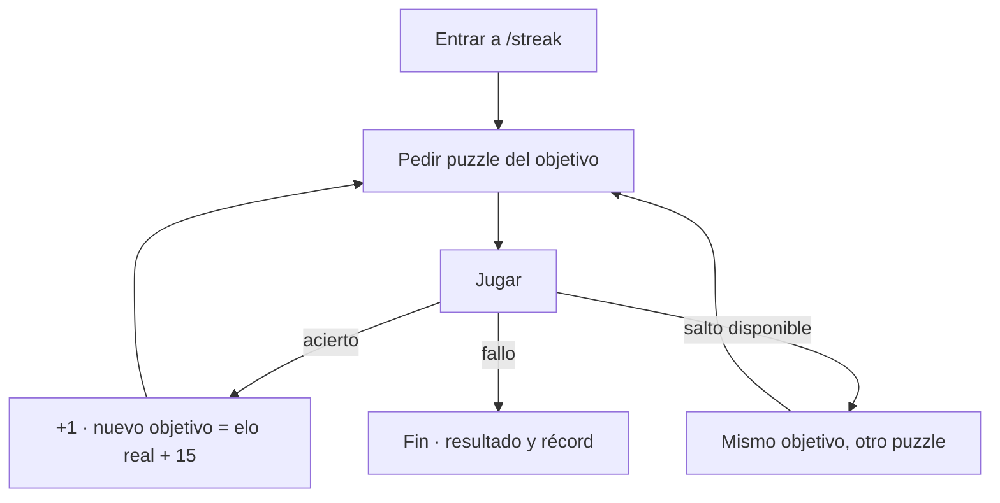

# Flujo del modo Racha

Modo de **muerte súbita**: el usuario encadena puzzles cada vez más difíciles y
el **primer error termina la partida**. La puntuación es simplemente cuántos
resolvió seguidos, y el objetivo es batir su propia marca.

> Este documento describe cómo funciona lo implementado. La idea original
> (planificación) está en [`../features/RACHA_STREAK.md`](../features/RACHA_STREAK.md).

---

## Reglas del modo

| Regla | Comportamiento |
|---|---|
| **Fin de racha** | El primer fallo termina la partida. |
| **Puntuación** | Puzzles resueltos consecutivos. |
| **Dificultad** | Arranca en **800** y sube **15 por acierto**, encadenada al elo real de cada puzzle. |
| **Reloj** | **No hay**. El usuario piensa lo que necesite. |
| **Pistas** | No hay. |
| **Salto** | **Uno por racha**: cambia de puzzle sin contar acierto ni fallo. |
| **Tema** | Mezclado: uno distinto (y al azar) por puzzle. |
| **Elo del usuario** | **No se toca**. Jugar arriesgado en la racha no penaliza el perfil. |
| **Récord** | Se guarda en el dispositivo. Abandonar no lo rompe: lo logrado cuenta. |

**La racha no tiene límite de ejercicios.** Lo único acotado es la dificultad,
por el catálogo: los puzzles llegan hasta 2800, y con un paso de 15 harían falta
unos 130 aciertos seguidos para acercarse. En la práctica nadie lo ve, así que
no hay ningún estado de "dificultad máxima" que mostrar.

## La rampa

El objetivo del siguiente puzzle es **el elo real del que se acaba de resolver,
más 15**, sin bajar nunca del objetivo anterior. No es una fórmula sobre el
número de aciertos, y eso importa por tres razones:

- **El número que ve el usuario es el de verdad**, el del ejercicio que tiene
  delante, no un objetivo teórico.
- **Se autocorrige**: si el catálogo sirve algo desviado, el siguiente objetivo
  parte de donde está realmente.
- **No es adivinable**: dos rachas con la misma puntuación no llevan el mismo
  elo, porque el puzzle se sortea dentro de su franja (ver más abajo).

El objetivo anterior hace de **suelo**, de modo que la dificultad no puede
retroceder ni estancarse. Ojo con el matiz: lo que nunca baja es el *objetivo*.
El elo *real* de dos puzzles seguidos sí puede moverse unos puntos arriba y
abajo, porque cada uno se sortea dentro de su franja — que es justo la
sensación buscada.

---

## ¿Cómo está montado?

- **Lógica pura** ([`streak.util.ts`](../../apps/chessColate/src/app/services/streak.util.ts)) — la rampa de dificultad, la elección de tema y cómo una racha actualiza el récord. Testeada en [`streak.util.spec.ts`](../../apps/chessColate/src/app/services/streak.util.spec.ts).
- **Fuente de puzzles** ([`streak.service.ts`](../../apps/chessColate/src/app/services/streak.service.ts)) — pide **un** puzzle al catálogo para el elo objetivo, sin repetir los ya jugados.
- **Persistencia** ([`streak-storage.service.ts`](../../apps/chessColate/src/app/services/streak-storage.service.ts)) — récord y últimas 20 rachas en localStorage.
- **Pantalla** ([`streak.page.ts`](../../apps/chessColate/src/app/pages/streak/streak.page.ts)) — el bucle del juego y la pantalla de resultado.
- **Modelo** ([`streak.model.ts`](../../libs/models/src/lib/streak.model.ts)) — `StreakConfig`, `StreakRun`, `StreakRecord`.

**No crea un `Plan`.** Las rutinas se juegan por bloques con un set precargado;
aquí la sesión es abierta y el puzzle se pide de a uno, así que el modo vive en
su propia pantalla en vez de añadir un tercer caso especial al componente de
entrenamiento (que ya carga los de Reto 333 e Infinito).

---

## El bucle del juego

### De dónde sale cada puzzle

Para el elo objetivo, el servicio:

1. Se queda con los temas que **de verdad tienen puzzles a ese elo** (según el
   manifiesto del catálogo) → variedad sin pedir archivos que no existen. En la
   práctica hay **más de 40 temas disponibles en cualquier punto de la rampa**.
2. Entre ellos **prefiere uno cuyo archivo ya esté descargado** (si hay al menos
   5), y si no, elige cualquiera al azar y de paso amplía la caché.
3. Pide **justo el archivo del elo objetivo** y coge uno **al azar** de dentro,
   descartando los ya jugados en la racha.
4. Si ese archivo no da nada nuevo, reintenta con otro tema y solo entonces
   abre la banda (±100, ±300) antes que dejar la racha sin puzzle. En esas
   bandas de rescate sí se elige el más cercano al objetivo.

**Por qué el archivo exacto y al azar dentro.** El catálogo guarda los puzzles
en archivos de 20 puntos de elo que **pesan entre 250 y 700 KB**. Pedir una
banda obliga a bajar varios archivos por puzzle; pedir el del objetivo baja
**uno solo**. Y como todos los puzzles de ese archivo caen en la misma franja de
20 puntos, **sortear uno cualquiera hace que el elo ronde el objetivo sin
descargar nada de más**: la variación sale gratis.

El sorteo **no introduce sesgo**. El objetivo cae en cualquier punto de su
archivo, así que la desviación se reparte a ambos lados y el avance real por
acierto es el paso configurado, ni más ni menos. Comprobado contra el CDN real
sobre una racha de 60 puzzles: **0 sin servir, 0 repeticiones, 1 archivo por
puzzle, avance medio de 15,1 puntos**, desviación frente al objetivo entre −17
y +16 con media +0,3, y 30 valores distintos de desviación — el número no se
puede adivinar a partir de la puntuación. Del puzzle 1 al 60 el elo fue de 813
a 1705.

Mientras el usuario resuelve, **el siguiente puzzle ya se está descargando**, así
que al acertar la transición es instantánea. Si la racha termina antes, el
puzzle precargado simplemente se descarta.

### Detalles que importan

- **Respiro de 450 ms tras acertar** — sin él el tablero cambia tan rápido que
  no da tiempo a ver la jugada buena.
- Durante ese respiro el tablero sigue admitiendo jugadas, así que **se ignora
  cualquier movimiento extra**: un toque de más no puede romper la racha.
- Mientras se descarga un puzzle, un velo sobre el tablero impide seguir jugando
  el anterior por inercia.
- **Salir cuenta como abandono** (`quit`): la racha lograda se registra igual y
  puede ser récord, pero no hay pantalla de resultado — el usuario ya se va.
- Una racha **cuenta como sesión de entrenamiento** para el recordatorio diario
  (ver [`RECORDATORIOS_ENTRENAMIENTO_FLOW.md`](./RECORDATORIOS_ENTRENAMIENTO_FLOW.md)).

---

## Dónde se entra

- **Tarjeta en el inicio**, junto a la del Reto 333, con la última racha y el récord.
- **Menú lateral**, en el grupo de ejercicios de entrenamiento.

---

## Qué se guarda

En localStorage, sin cuenta ni servidor:

| Clave | Contenido |
|---|---|
| `chessColate_streak_record` | Mejor racha, cuándo se logró, rachas jugadas y última puntuación. |
| `chessColate_streak_runs` | Las 20 rachas más recientes (sin los ids de los puzzles). |

---

## Analítica

| Evento | Cuándo | Params |
|---|---|---|
| `streak_started` | arranca una racha | `elo_base`, `step`, `theme` |
| `streak_skip_used` | usa el salto | `at_score`, `elo` |
| `streak_new_record` | supera su marca | `score`, `previous_best` |
| `streak_ended` | termina (fallo o abandono) | `score`, `ended_by`, `skips_used`, `max_elo_reached`, `duration_ms` |

Además emite los `puzzle_started` / `puzzle_completed` de siempre con
`routine_kind: 'streak'`, para que la racha se compare con el resto de modos.

---

## Lo que quedó fuera

- **Compartir el resultado** — se decidió dejarlo para más adelante.
- **Récord sincronizado con la cuenta** — hoy vive solo en el dispositivo.
- **Leaderboard** — necesita backend.
- **Rampa adaptativa** (que suba más rápido si resuelves muy rápido) y **elegir
  tema** desde la interfaz: la configuración existe en el modelo, pero la
  pantalla usa siempre la de por defecto.
