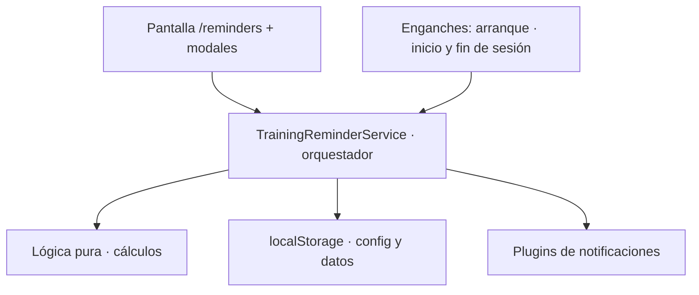
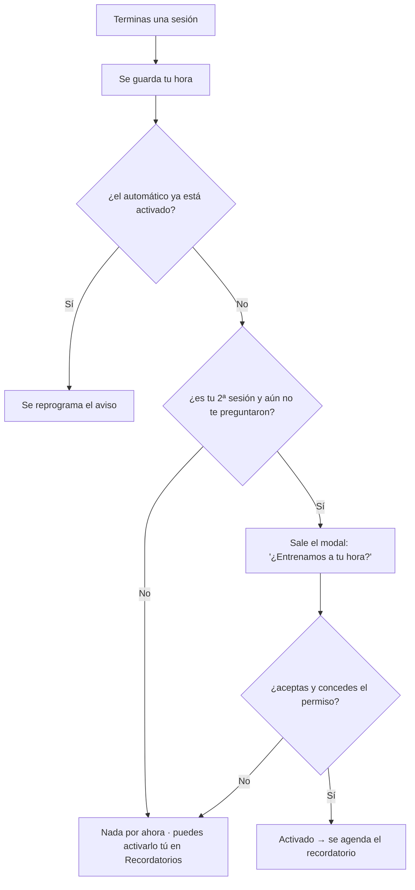
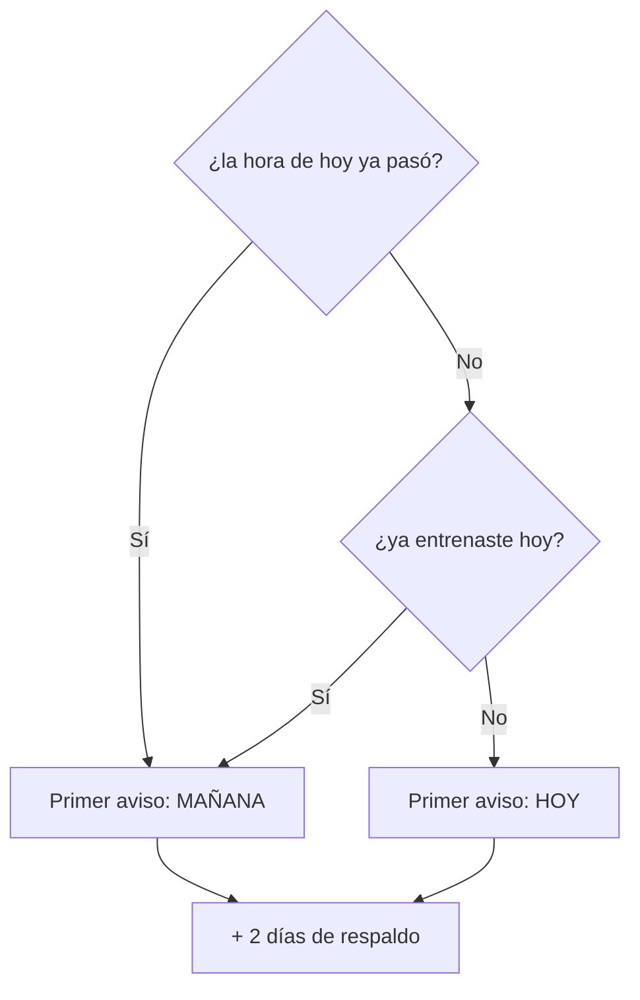
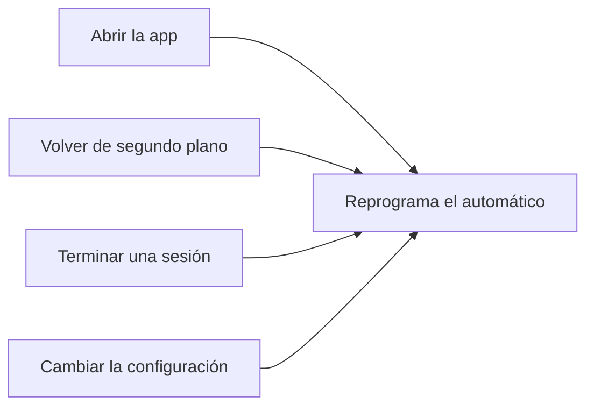
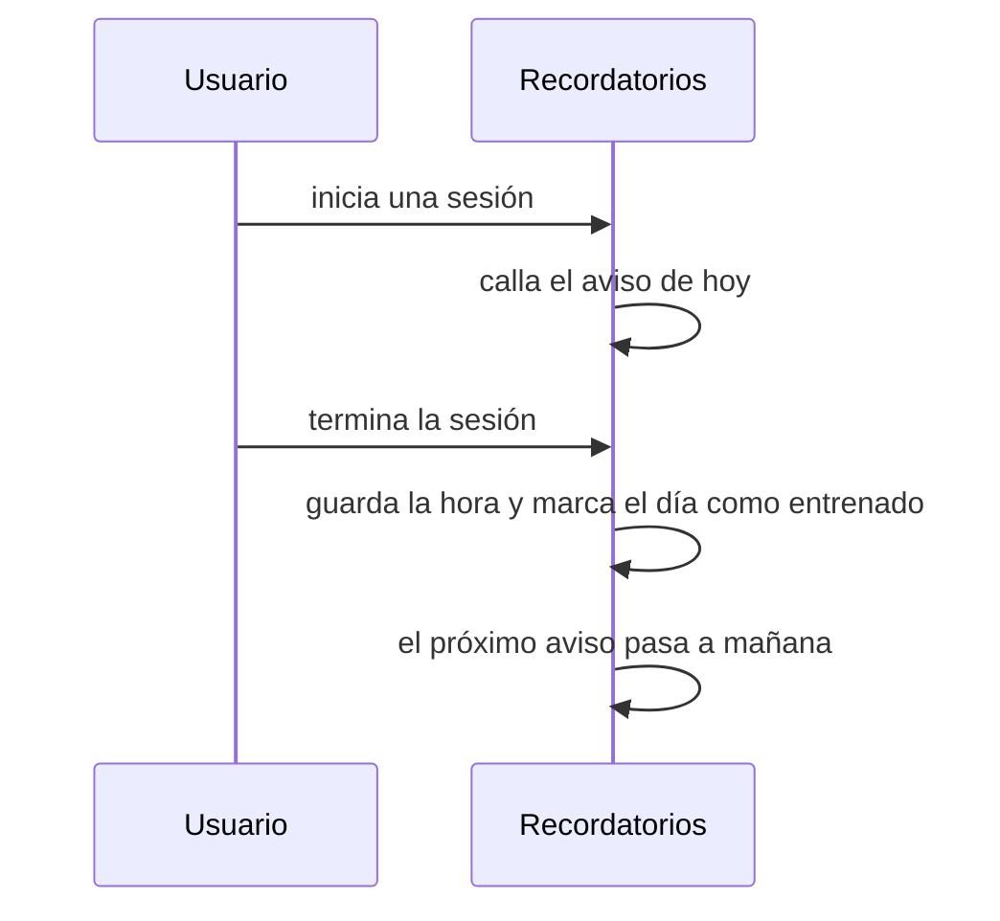
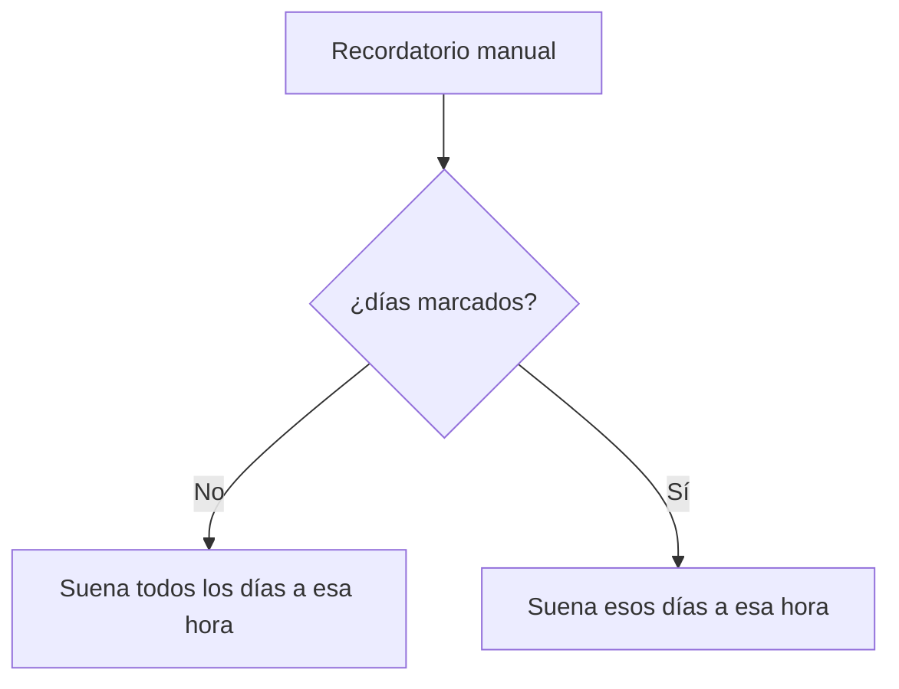

# Flujo de Recordatorios de Entrenamiento

Recordatorios locales (sin servidor) que invitan a volver a entrenar. Es una feature **solo de la app móvil**: en web no hace nada. Hay dos tipos:

- **Automático** — aprende tu hora habitual y avisa a esa hora, **solo si ese día aún no has entrenado**.
- **Manuales** — alarmas fijas que creas tú (hora + días de la semana). Suenan siempre.

> Este documento describe cómo funciona lo implementado. La idea original (planificación) está en [`../features/NOTIFICACIONES_ENTRENAMIENTO.md`](../features/NOTIFICACIONES_ENTRENAMIENTO.md).

---

## ¿Cómo está montado?



- **Lógica pura** (`training-reminder.util.ts`) — los cálculos (hora, fechas, racha). Testeable.
- **Storage** (`training-reminder-storage.service.ts`) — guarda config, historial de horas y manuales en localStorage.
- **Orquestador** (`training-reminder.service.ts`) — agenda/cancela notificaciones y habla con los plugins. Todo es no-op en web.
- **Pantalla** (`/reminders`) — activar el automático, crear manuales y ver las próximas notificaciones.

---

## ¿Cuándo empieza a funcionar el automático?

**No basta con entrenar.** Entrenar solo guarda tu hora; para que se agende un recordatorio hacen falta además **activarlo** y **conceder el permiso** de notificaciones:



Se activa de dos maneras:

- **Te lo ofrece la app** — tras tu **2ª sesión** aparece un aviso ("¿Entrenamos a tu hora?"); si aceptas y das el permiso, queda activado. Sale **una sola vez**. (Si ya tenías partidas de antes, puede salir ya en la 1ª.)
- **Lo activas tú** — en **Recordatorios**, con el toggle. Te pide el permiso en ese momento.

Qué esperar en una instalación nueva:

| Momento | Qué pasa |
|---|---|
| Sesión 1 | Solo se guarda tu hora. Nada agendado. |
| Sesión 2 | Aparece el aviso → aceptas y das permiso → **activado**. |
| Primer recordatorio | Normalmente **mañana** (hoy ya entrenaste), a la **media hora más cercana** a cuando entrenaste. |
| Tras ~5 sesiones | La hora se afina a tu **franja más frecuente**. |

> ¿No quieres esperar? Actívalo en Recordatorios y usa **"Probar ahora"** para recibir una notificación al instante.

---

## ¿Cuándo suena el automático? ⭐

Se agenda **un aviso al día**. El de hoy solo suena si aún no ha pasado su hora **y** no has entrenado hoy; si no, el primero cae mañana:



Se agendan 3 días por adelantado (el del día + 2 de respaldo, por si no abres la app un par de días).

> **Ojo al probar:** tu hora se registra al **terminar** una sesión, y terminarla te marca como "ya entrenado hoy" — así que justo después de entrenar el aviso siempre pasa a mañana. Para verificar al instante usa **"Probar ahora"** en la pantalla.

---

## ¿Cuándo se recalcula?

Cada vez que abres la app, vuelves de segundo plano, terminas una sesión o cambias la configuración, la app vuelve a agendar: cancela lo anterior y pone el siguiente aviso a la hora correcta.



Alrededor de una sesión:



---

## ¿Cómo sabe mi hora habitual?

Mira la hora de tus **últimas sesiones** (hasta 30, de los últimos 14 días) y **redondea a la media hora más cercana** (9:51 → 10:00, 9:38 → 9:30):

- **Desde la 1ª sesión**: usa la hora de tu sesión más reciente redondeada, para que el aviso se parezca ya a cuando entrenas.
- **Con ≥ 5 sesiones**: usa tu franja más frecuente (moda), y marca la sugerencia como "según tus sesiones".
- **Sin ninguna sesión aún**: cae a las **8:00 pm** por defecto.

Nunca propone madrugadas: acota el aviso a la franja **7:00–22:30**. Puedes fijar tu propia hora y entonces manda la tuya.

El texto del aviso rota entre varios mensajes; si llevas una racha activa, usa uno que apela a no perderla.

---

## ¿Qué son los recordatorios manuales?

Alarmas que creas tú, con hora, días de la semana (o todos) y una etiqueta opcional:



A diferencia del automático, **suenan siempre** (no se saltan el día aunque ya hayas entrenado) y los repite el propio sistema. Máximo 15.

---

## ¿Cómo lo pruebo?

```bash
npm run android:build && npm run android:run
```

1. Entra a **Recordatorios** (Ajustes → Recordatorios, o el menú lateral) y toca **"Probar ahora"** → debe llegar en segundos.
2. Crea un manual a 2–3 minutos, manda la app a segundo plano → llega a su hora.
3. En **"Próximas notificaciones"** ves la lista de todo lo agendado (automáticas + manuales).

> En web no funciona nada: es solo nativo.

---

## Detalles y límites

- **Al tocar la notificación** se abre el **home** (donde está el menú de rutinas).
- **Permiso**: se pide al activar el automático, crear un manual o probar. En Android 13+ hace falta `POST_NOTIFICATIONS`.
- **Solo Android verificado.** iOS queda preparado, pero sin probar.
- **Hora aproximada** (margen de minutos): no usa alarmas exactas, que Android 14+ restringe.
- **Idioma**: el texto se fija al agendar; si cambias de idioma, se corrige la próxima vez que la app reprograma.
- Se registran eventos de analítica: activación, agendado, tap, alta/baja de manuales y prueba.

---

## Archivos

| Archivo | Rol |
|---------|-----|
| `services/training-reminder.util.ts` (+ `.spec`) | Cálculos (lógica pura) |
| `services/training-reminder-storage.service.ts` (+ `.spec`) | Persistencia (localStorage) |
| `services/training-reminder.service.ts` | Orquestador |
| `pages/reminders/` | Pantalla `/reminders` |
| `shared/components/reminder-permission-modal/`, `manual-reminder-modal/` | Modales |
| `app.component.ts`, `plan.service.ts`, `training.component.ts`, `plan-played.component.ts` | Enganches (arranque, inicio/fin de sesión, modal de contexto) |
| `capacitor.config.ts`, `AndroidManifest.xml`, `res/drawable/ic_stat_reminder.xml` | Config nativa |
