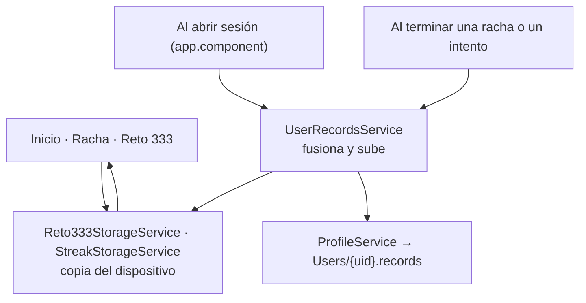

# Récords sincronizados con la cuenta

Las marcas del **Reto 333** y del **modo Racha** vivían solo en el dispositivo:
al cambiar de móvil, entrar desde la web o reinstalar la app, el usuario las
perdía. Ahora, cuando hay sesión iniciada, viajan también con el perfil.

---

## Dónde se guardan

Dentro del **documento del perfil**, en `Users/{uid}.records`:

```
records: {
  reto333: { lastScore, bestScore, maxElo, lastTime, timeString, completed, lastPlayedAt, uidUser }
  streak:  { bestScore, bestRunUid, achievedAt, runsPlayed, lastScore, lastPlayedAt, uidUser }
}
```

No se creó una colección aparte a propósito: son un puñado de números por
usuario, **llegan gratis con el perfil** al iniciar sesión (sin una lectura de
más) y no hacen falta reglas de seguridad nuevas.

El dispositivo sigue teniendo su copia en localStorage
(`chesscolate_reto333_stats` y `chessColate_streak_record`): es la que se pinta
al abrir, sin red y sin esperar a que resuelva la sesión.

---

## Las piezas



- **Copia local** — [`reto333-storage.service.ts`](../../apps/chessColate/src/app/services/reto333-storage.service.ts) y [`streak-storage.service.ts`](../../apps/chessColate/src/app/services/streak-storage.service.ts). Solo localStorage; no saben nada de Firestore.
- **Sincronización** — [`user-records.service.ts`](../../apps/chessColate/src/app/services/user-records.service.ts). Es el único que habla con los dos lados.
- **Lógica pura de fusión** — [`user-records.util.ts`](../../apps/chessColate/src/app/services/user-records.util.ts), probada en [`user-records.util.spec.ts`](../../apps/chessColate/src/app/services/user-records.util.spec.ts).
- **Modelos** — [`reto333.model.ts`](../../libs/models/src/lib/reto333.model.ts) y `UserRecords` en [`profile.model.ts`](../../libs/models/src/lib/profile.model.ts).

---

## Cómo se fusionan las dos copias

Los dos lados pueden ir por delante (se juega sin conexión, se juega en el móvil
y luego en la web…), así que no gana una copia entera: se toma lo mejor de cada
lado campo a campo.

| Dato | Regla |
|---|---|
| Mejor marca (`bestScore` y lo que la acompaña) | La más alta de las dos |
| Último intento / última racha | La del lado que jugó más tarde (`lastPlayedAt`) |
| Partidas jugadas (`runsPlayed`) | El mayor de los dos, **nunca la suma** (sumar contaría dos veces lo ya sincronizado) |

El resumen del último intento del Reto 333 (puntuación, elo, tiempo y si llegó a
333) viaja **junto**: describe una misma partida y mezclarlo mentiría.

---

## Cuándo se sincroniza

1. **Al resolverse la sesión** ([`app.component.ts`](../../apps/chessColate/src/app/app.component.ts)) — justo después de cargar el perfil y **antes** de marcar la app como inicializada, para que el inicio ya pinte las marcas buenas. Si tras fusionar el resultado es idéntico a lo que ya había en el perfil, no se escribe nada.
2. **Al terminar** una racha o un intento del Reto 333 — se guarda en el dispositivo y se sube al perfil. La subida no bloquea la pantalla de resultado.

Sin sesión no se sincroniza nada: quien juega como invitado solo tiene la copia
local, y **se la lleva consigo al registrarse** (una marca sin dueño se adopta).

## Marcas de otra cuenta

Cada récord guarda el `uidUser` de su dueño. Si en el dispositivo hay una marca
de **otra** cuenta, al iniciar sesión se descarta en vez de fusionarse: nadie
hereda el récord de quien usó el móvil antes. Lo jugado sin sesión (sin dueño) sí
se adopta, que es el caso de quien prueba la app y luego se registra.
