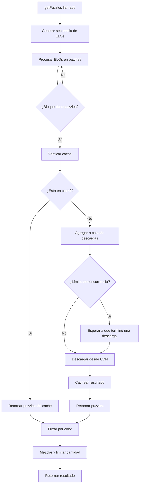
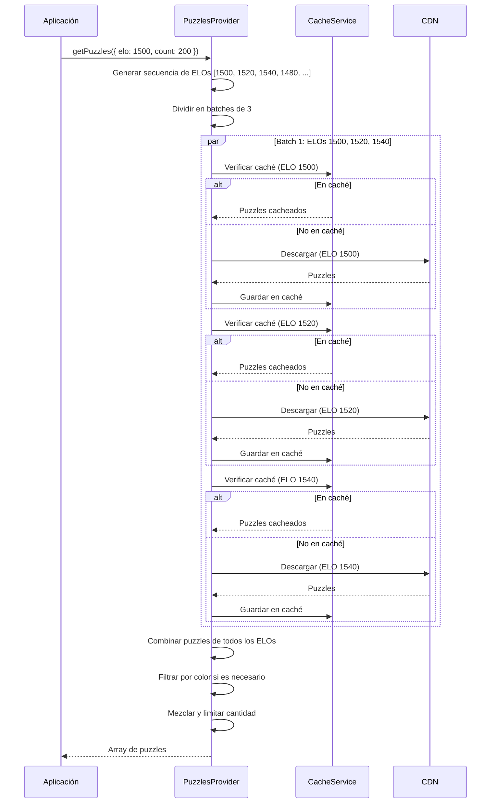

# @chesspark/puzzles-provider

Librería TypeScript para obtener puzzles de ajedrez desde CDN con caché local inteligente.

## Características

- ✅ **TypeScript puro**: Sin dependencias de frameworks específicos
- 🚀 **Caché local**: Usa IndexedDB para almacenamiento eficiente
- 🎯 **Búsqueda inteligente por ELO**: Incrementa/decrementa automáticamente para obtener la cantidad de puzzles requerida
- ⚡️ **Descargas paralelas**: Procesa múltiples archivos simultáneamente para mejorar el rendimiento
- 🎨 **Múltiples temas**: Soporte para más de 50 temas diferentes
- ♟️ **Aperturas**: Soporte para más de 60 aperturas diferentes
- 🔄 **Flexible**: Configurable y extensible

## Instalación

```bash
npm install @chesspark/puzzles-provider
```

## Uso Básico

```typescript
import { createPuzzlesProvider } from '@chesspark/puzzles-provider';

// Crear e inicializar el proveedor
const provider = await createPuzzlesProvider();

// Obtener 200 puzzles de nivel 1500
const puzzles = await provider.getPuzzles({ elo: 1500 });

console.log(puzzles);
```

## Ejemplos Avanzados

### Obtener puzzles de un tema específico

```typescript
const puzzles = await provider.getPuzzles({
  elo: 1800,
  theme: 'fork',
  count: 100,
});
```

### Obtener puzzles de una apertura

```typescript
const puzzles = await provider.getPuzzles({
  elo: 1600,
  openingFamily: 'Sicilian_Defense',
  count: 150,
});
```

### Filtrar por color

```typescript
// Obtener puzzles donde el jugador juega con blancas
const whitePuzzles = await provider.getPuzzles({
  elo: 1500,
  color: 'w',
  count: 200,
});
```

### Configuración personalizada

```typescript
import { PuzzlesProvider } from '@chesspark/puzzles-provider';

const provider = new PuzzlesProvider({
  cdnBaseUrl: 'https://cdn.jsdelivr.net/gh',
  githubUser: 'json-alzate',
  enableCache: true,
  cacheExpirationMs: 7 * 24 * 60 * 60 * 1000, // 7 días
  maxConcurrentDownloads: 5, // Máximo de descargas simultáneas
  batchSize: 3, // Tamaño del batch para procesar ELOs
});

await provider.init();
```

## API

### `PuzzlesProvider`

Clase principal para obtener puzzles.

#### Constructor

```typescript
constructor(config?: PuzzlesProviderConfig)
```

**Parámetros:**
- `config` (opcional): Configuración del proveedor
  - `cdnBaseUrl`: URL base del CDN (por defecto: `https://cdn.jsdelivr.net/gh`)
  - `githubUser`: Usuario de GitHub (por defecto: `json-alzate`)
  - `enableCache`: Habilitar caché local (por defecto: `true`)
  - `cacheExpirationMs`: Tiempo de expiración del caché en ms (por defecto: 7 días)
  - `maxConcurrentDownloads`: Número máximo de descargas simultáneas (por defecto: `5`)
  - `batchSize`: Tamaño del batch para procesar ELOs en paralelo (por defecto: `3`)

#### Métodos

##### `init(): Promise<void>`

Inicializa el proveedor. Debe llamarse antes de usar `getPuzzles`.

##### `getPuzzles(options?: PuzzleQueryOptions): Promise<Puzzle[]>`

Obtiene puzzles según los criterios especificados.

**Parámetros:**
- `options` (opcional): Opciones de consulta
  - `elo`: Nivel de ELO (por defecto: 1500)
  - `theme`: Tema del puzzle (opcional)
  - `openingFamily`: Familia de apertura (opcional)
  - `color`: Color del jugador ('w', 'b' o 'N/A')
  - `count`: Cantidad de puzzles a devolver (por defecto: 200, máximo: 200)

**Retorna:** Array de puzzles que cumplen los criterios.

##### `clearCache(): Promise<void>`

Limpia todo el caché de puzzles.

##### `getCacheSize(): Promise<number>`

Obtiene el número de entradas en el caché.

##### `close(): void`

Cierra la conexión del caché. Debe llamarse cuando ya no se vaya a usar el proveedor.

### `createPuzzlesProvider(config?: PuzzlesProviderConfig): Promise<PuzzlesProvider>`

Función helper para crear y inicializar rápidamente un proveedor.

## Tipos

### `Puzzle`

```typescript
interface Puzzle {
  uid: string;
  fen: string;
  moves: string;
  rating: number;
  ratingDeviation?: number;
  popularity?: number;
  nbPlays?: number;
  themes?: string[];
  gameUrl?: string;
  openingFamily?: string;
  openingVariation?: string;
}
```

### `PuzzleQueryOptions`

```typescript
interface PuzzleQueryOptions {
  elo?: number;
  theme?: string;
  openingFamily?: string;
  color?: 'w' | 'b' | 'N/A';
  count?: number;
}
```

## Constantes

### Temas disponibles

Puedes importar la lista completa de temas:

```typescript
import { AVAILABLE_THEMES } from '@chesspark/puzzles-provider';

console.log(AVAILABLE_THEMES);
// ['opening', 'middlegame', 'endgame', 'fork', 'pin', ...]
```

### Aperturas disponibles

```typescript
import { AVAILABLE_OPENINGS } from '@chesspark/puzzles-provider';

console.log(AVAILABLE_OPENINGS);
// ['Sicilian_Defense', 'French_Defense', 'Italian_Game', ...]
```

## Cómo Funciona

### Búsqueda Inteligente por ELO

La librería implementa una búsqueda inteligente cuando no hay suficientes puzzles en el rango de ELO especificado:

1. **Búsqueda inicial**: Busca puzzles en el rango de ELO especificado (ej: 1500-1519)
2. **Incremento**: Si no hay suficientes, busca en rangos superiores (1520-1539, 1540-1559, ...)
3. **Decremento**: Si aún no hay suficientes, busca en rangos inferiores (1480-1499, 1460-1479, ...)
4. **Límites**: Se detiene al llegar a los límites (400 o 2800)

### Paralelización de Descargas

Para mejorar significativamente el rendimiento, la librería procesa múltiples archivos en paralelo:

- **Procesamiento por batches**: Los ELOs se procesan en grupos (batches) de tamaño configurable
- **Control de concurrencia**: Un semáforo limita el número de descargas simultáneas para evitar sobrecargar la red
- **Descargas paralelas**: Múltiples archivos JSON se descargan simultáneamente en lugar de secuencialmente
- **Resultado**: Reducción del tiempo de carga en 60-80% comparado con descargas secuenciales

### Sistema de Caché

- Usa **IndexedDB** para almacenamiento local eficiente
- Almacena los puzzles descargados por URL
- Verifica automáticamente la expiración (configurable)
- No bloquea la respuesta al cachear
- Las verificaciones de caché se realizan en paralelo sin afectar las descargas

## Cómo Funciona Internamente

### Flujo de Obtención de Puzzles



### Proceso de Búsqueda por ELO con Paralelización



### Control de Concurrencia

El sistema utiliza un semáforo para controlar el número máximo de descargas simultáneas:

1. Cuando se solicita una descarga, se verifica si hay espacio disponible
2. Si se alcanza el límite (`maxConcurrentDownloads`), se espera a que termine una descarga
3. Una vez que hay espacio, se inicia la descarga y se agrega a la cola
4. Cuando termina, se elimina de la cola, liberando espacio para la siguiente

## Optimización de Rendimiento

### Mejores Prácticas

1. **Usar caché**: El caché reduce significativamente el tiempo de carga en cargas subsecuentes
2. **Configurar concurrencia**: Ajusta `maxConcurrentDownloads` según tu conexión:
   - Conexiones lentas: 3-5 descargas simultáneas
   - Conexiones rápidas: 5-10 descargas simultáneas
3. **Ajustar batch size**: El `batchSize` controla cuántos ELOs se procesan juntos:
   - Valores más altos (5-7): Mejor para conexiones rápidas
   - Valores más bajos (2-3): Mejor para conexiones lentas o dispositivos móviles
4. **Cargar bloques en paralelo**: Si tu aplicación carga múltiples bloques, usa `Promise.all()` para cargarlos en paralelo

### Ejemplo: Carga Paralela de Múltiples Bloques

```typescript
// En lugar de cargar secuencialmente:
for (const block of blocks) {
  block.puzzles = await provider.getPuzzles({ elo: block.elo, theme: block.theme });
}

// Carga en paralelo (mucho más rápido):
const puzzlePromises = blocks.map(async (block) => {
  block.puzzles = await provider.getPuzzles({ elo: block.elo, theme: block.theme });
  return block;
});

await Promise.all(puzzlePromises);
```

### Impacto en el Rendimiento

- **Primera carga (sin caché)**: 60-80% más rápido con paralelización
- **Cargas subsecuentes (con caché)**: Casi instantáneo
- **Múltiples bloques**: Reducción de tiempo proporcional al número de bloques

## Ejemplos de Uso en Aplicaciones

### Angular

```typescript
import { Injectable } from '@angular/core';
import { PuzzlesProvider } from '@chesspark/puzzles-provider';

@Injectable({
  providedIn: 'root'
})
export class PuzzlesService {
  private provider!: PuzzlesProvider;

  async init() {
    this.provider = new PuzzlesProvider();
    await this.provider.init();
  }

  async getPuzzles(elo: number) {
    return await this.provider.getPuzzles({ elo });
  }
}
```

### React

```typescript
import { useEffect, useState } from 'react';
import { createPuzzlesProvider, Puzzle } from '@chesspark/puzzles-provider';

function usePuzzles(elo: number) {
  const [puzzles, setPuzzles] = useState<Puzzle[]>([]);
  const [loading, setLoading] = useState(true);

  useEffect(() => {
    async function fetchPuzzles() {
      const provider = await createPuzzlesProvider();
      const data = await provider.getPuzzles({ elo });
      setPuzzles(data);
      setLoading(false);
      provider.close();
    }
    fetchPuzzles();
  }, [elo]);

  return { puzzles, loading };
}
```

### Vanilla JavaScript

```javascript
import { createPuzzlesProvider } from '@chesspark/puzzles-provider';

async function loadPuzzles() {
  const provider = await createPuzzlesProvider();
  const puzzles = await provider.getPuzzles({ elo: 1500, count: 100 });
  
  console.log(`Loaded ${puzzles.length} puzzles`);
  
  provider.close();
}

loadPuzzles();
```

## Desarrollo

### Construir la librería

```bash
nx build puzzles-provider
```

### Ejecutar tests

```bash
nx test puzzles-provider
```

### Linting

```bash
nx lint puzzles-provider
```

## Contribuir

Las contribuciones son bienvenidas. Por favor:

1. Fork el repositorio
2. Crea una rama para tu feature
3. Commit tus cambios
4. Push a la rama
5. Crea un Pull Request

## Licencia

MIT
